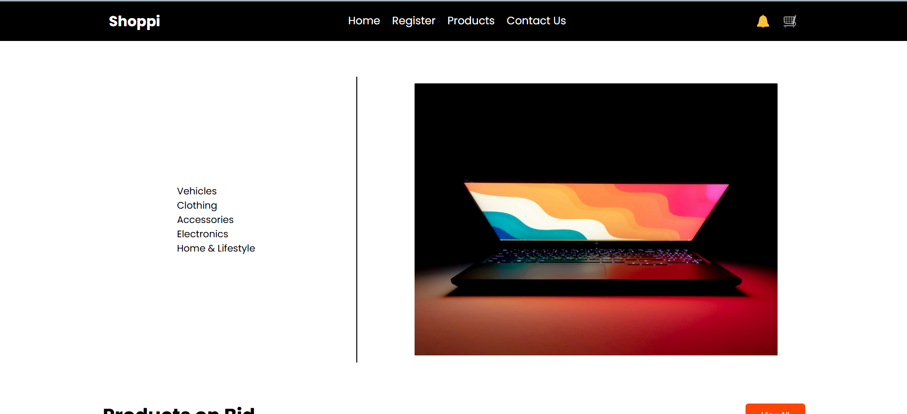
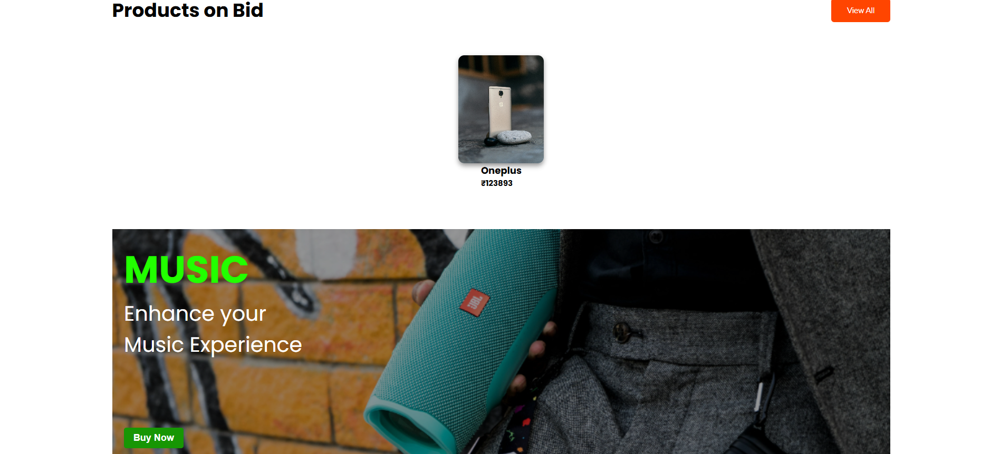
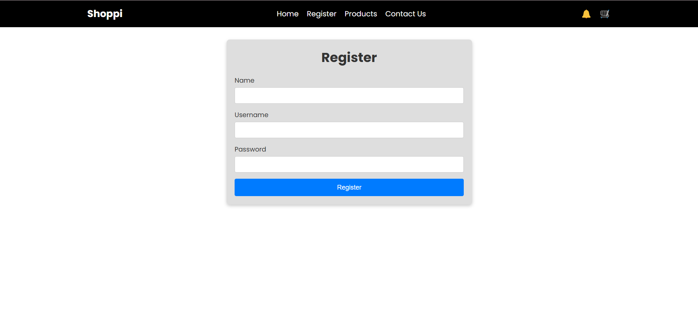
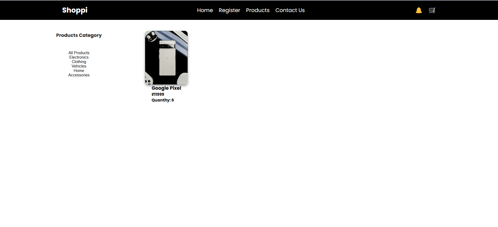

# 🛍️ Real-Time Bidding Platform

A full-stack MERN (MongoDB, Express, React, Node.js) application where users 
can browse products and place **real-time bids**. Admins can upload products 
with images, and all bids are handled through **Socket.io** for instant 
updates.

## 🚀 Features

- 🧾 Product Listings with Images
- 🔒 User Authentication (JWT-based)
- ⚡ Real-Time Bidding using Socket.io
- 📤 Admin Product Upload
- 📸 Image Uploads Stored in Server Directory
- 📊 Bid History & Live Updates
- 🛠️ Fully Responsive UI (React + CSS Modules)

## 🧑‍💻 Tech Stack

| Frontend | Backend | Real-Time | Database |
|----------|---------|-----------|----------|
| React.js | Node.js | Socket.io | MongoDB  |
| Axios    | Express |           | Mongoose |

## 📸 Demo Screenshot

